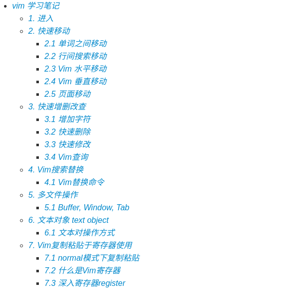

<!--
 * @Description: Readme.md
 * @Autor: Zhiqi Feng
 * @E-mail: feng_1510@outlook.com
 * @Date: 2021-04-29 22:03:17
 * @LastEditors: Zhiqi Feng
 * @LastEditTime: 2021-06-03 15:40:32
-->
# 记录自己学习的一些笔记
## 1. [Git学习记录（git_learnning: 2020/02/09---2020/02/10](https://github.com/feng1510/learnning/tree/master/git_learnning)

## 2. [Vim学习记录（vim_learnning: 2020/02/06---		)](https://github.com/feng1510/learnning/tree/master/vim_learnning)

## 3. [规划方法学习（planning_learnning）](https://github.com/feng1510/learnning/tree/master/planning_learnning)

## 4. [决策方法学习（decision_making）](https://github.com/feng1510/learnning/tree/master/decision_making)

### 4.1 [强化学习（RL）](https://github.com/feng1510/learnning/tree/master/decision_making/RL)

### 4.2 [贝叶斯推理（Bayes）]()