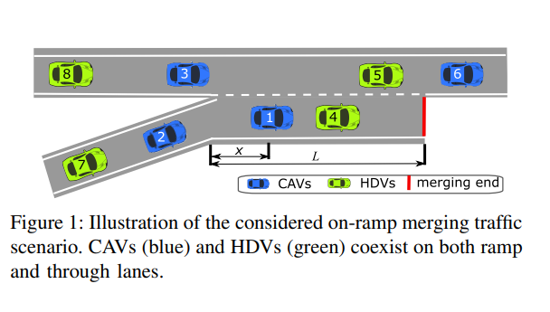
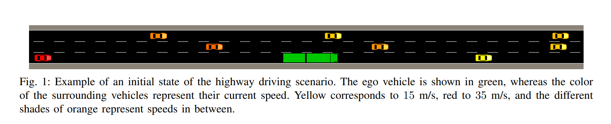
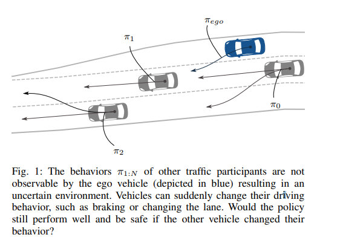

<!--
 * @Description: 
 * @Autor: Zhiqi Feng
 * @E-mail: feng_1510@outlook.com
 * @Date: 2021-05-22 12:22:56
 * @LastEditors: Zhiqi Feng
 * @LastEditTime: 2021-05-22 12:30:04
-->

# 自动驾驶决策系统的决策算法--强化学习部分
## 1. 一些开源工作的学习
### 1.1 [Deep Multi-agent Reinforcement Learning for Highway On-Ramp Merging in Mixed Traffic](https://arxiv.org/pdf/2105.05701v1.pdf)

github链接: https://github.com/Derekabc/MARL_CAVs

### 1.2 [Tactical Decision-Making in Autonomous Driving by Reinforcement Learning with Uncertainty Estimation](https://arxiv.org/pdf/2004.10439v1.pdf)

github链接: https://github.com/carljohanhoel/BayesianRLForAutonomousDriving

### 1.3 [Counterfactual Policy Evaluation for Decision-Making in Autonomous Driving](https://arxiv.org/pdf/2003.11919v3.pdf)

github链接: https://github.com/bark-simulator/bark-ml