<!-- TOC -->

- [Git教程](#git%E6%95%99%E7%A8%8B)
    - [*1.学习目标*](#1%E5%AD%A6%E4%B9%A0%E7%9B%AE%E6%A0%87)
    - [*2.版本控制*](#2%E7%89%88%E6%9C%AC%E6%8E%A7%E5%88%B6)
        - [*2.1 本地版本控制系统*](#21-%E6%9C%AC%E5%9C%B0%E7%89%88%E6%9C%AC%E6%8E%A7%E5%88%B6%E7%B3%BB%E7%BB%9F)
        - [*2.2 集中化版本控制系统（Centrailized Version Control System, CVCS）*](#22-%E9%9B%86%E4%B8%AD%E5%8C%96%E7%89%88%E6%9C%AC%E6%8E%A7%E5%88%B6%E7%B3%BB%E7%BB%9Fcentrailized-version-control-system-cvcs)
        - [*2.3 分布式版本控制系统（Distributed Version Control System, DVCS）*](#23-%E5%88%86%E5%B8%83%E5%BC%8F%E7%89%88%E6%9C%AC%E6%8E%A7%E5%88%B6%E7%B3%BB%E7%BB%9Fdistributed-version-control-system-dvcs)
    - [*3. 环境配置+常见命令*](#3-%E7%8E%AF%E5%A2%83%E9%85%8D%E7%BD%AE%E5%B8%B8%E8%A7%81%E5%91%BD%E4%BB%A4)
    - [*4. Git的三种状态和工作模式*](#4-git%E7%9A%84%E4%B8%89%E7%A7%8D%E7%8A%B6%E6%80%81%E5%92%8C%E5%B7%A5%E4%BD%9C%E6%A8%A1%E5%BC%8F)
    - [*5. 创建版本库并提交文件*](#5-%E5%88%9B%E5%BB%BA%E7%89%88%E6%9C%AC%E5%BA%93%E5%B9%B6%E6%8F%90%E4%BA%A4%E6%96%87%E4%BB%B6)
    - [*6. 时光穿梭机*](#6-%E6%97%B6%E5%85%89%E7%A9%BF%E6%A2%AD%E6%9C%BA)
        - [*6.1 文件修改与提交*](#61-%E6%96%87%E4%BB%B6%E4%BF%AE%E6%94%B9%E4%B8%8E%E6%8F%90%E4%BA%A4)
        - [*6.2 版本回退*](#62-%E7%89%88%E6%9C%AC%E5%9B%9E%E9%80%80)
        - [*6.3 文件删除*](#63-%E6%96%87%E4%BB%B6%E5%88%A0%E9%99%A4)
    - [*7. 远程仓库*](#7-%E8%BF%9C%E7%A8%8B%E4%BB%93%E5%BA%93)
    - [*8. Git的分支操作*](#8-git%E7%9A%84%E5%88%86%E6%94%AF%E6%93%8D%E4%BD%9C)
        - [*8.1 本地分支操作*](#81-%E6%9C%AC%E5%9C%B0%E5%88%86%E6%94%AF%E6%93%8D%E4%BD%9C)
        - [*8.2 远程分支操作， push和pull*](#82-%E8%BF%9C%E7%A8%8B%E5%88%86%E6%94%AF%E6%93%8D%E4%BD%9C-push%E5%92%8Cpull)
        - [*8.3 分支操作冲突出现与解决*](#83-%E5%88%86%E6%94%AF%E6%93%8D%E4%BD%9C%E5%86%B2%E7%AA%81%E5%87%BA%E7%8E%B0%E4%B8%8E%E8%A7%A3%E5%86%B3)
            - [*8.3.1 本地分支操作冲突*](#831-%E6%9C%AC%E5%9C%B0%E5%88%86%E6%94%AF%E6%93%8D%E4%BD%9C%E5%86%B2%E7%AA%81)
            - [*8.3.2 多人协同合作的冲突*](#832-%E5%A4%9A%E4%BA%BA%E5%8D%8F%E5%90%8C%E5%90%88%E4%BD%9C%E7%9A%84%E5%86%B2%E7%AA%81)
    - [*9. 标签管理*](#9-%E6%A0%87%E7%AD%BE%E7%AE%A1%E7%90%86)

<!-- /TOC -->

# Git教程
链接：https://www.bilibili.com/video/BV1vf4y1r7UN?p=3&spm_id_from=pageDriver

git教程：https://www.cnblogs.com/yunwangjun-python-520/p/10449362.html

## *1.学习目标*
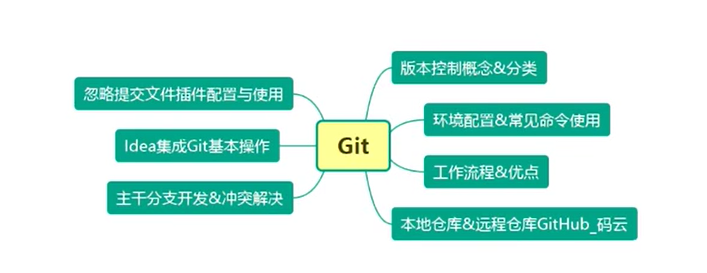

## *2.版本控制*

### *2.1 本地版本控制系统*
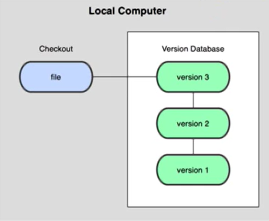
- 备份麻烦，易丢失，混淆版本
- 无法进行协同操作

### *2.2 集中化版本控制系统（Centrailized Version Control System, CVCS）*
单一集中管理服务器，保存所有文件的修订版本。协同工作人员可以通过链接服务器进行文件提取和提交。如SVN、CVS等。
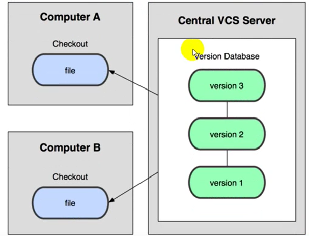

问题：
- 只有一台服务器进行文件备份，也会遇到文件无法及时备份，服务器宕机的问题。

### *2.3 分布式版本控制系统（Distributed Version Control System, DVCS）*
如Git, Mercurial等，客户端不仅仅提取最新的文件，而且把原始的代码仓库镜像到本地。任何一台协同工作的服务器发生故障，事后都可以用任何一个镜像出来的本地仓库进行恢复。因此每一次的提取操作实际上是对代码仓库的一次完整备份。淡化集中服务器的概念。

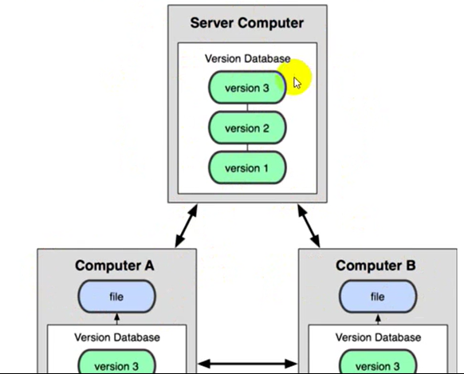

## *3. 环境配置+常见命令*
Git最早在Linux开发
- Win安装
https://git-scm.com/download/win
- ubuntu安装命令 `sudo apt-get install git`

- 使用之前的配置，为方便Git追踪到是哪个用户进行的修改，需要设置对应的用户名和邮箱地址
```
git config --global user.name "用户名"
git config --global user.email "邮箱地址"
git config --list   <查看所有配置>
```

## *4. Git的三种状态和工作模式*
- Git的三种模式

状态                |      描述
--                  |:-----------------
已提交(committed)   |   表示数据已经安全地保存到本地数据库
已修改(modified)    |   表示修改了文件，但还没有保存到数据库中
已暂存(staged)      |   表示对一个已经修改文件的当前版本做了标记，使之包含在下次提交的快照中。

- Git的三个工作区域：工作区、暂存区和Git仓库

分类                |      描述
--                  |:-----------------
工作区   |   本地的项目目录，直接编辑的地方
暂存区   |   数据暂时存放的区域，可在工作区和版本库之间进行数据的友好交流。Git的版本库里存了很多东西，其中最重要的就是称为`stage`（或者叫`index`）的暂存区，还有Git为我们自动创建的第一个分支`master`，以及指向`master`的一个指针叫`HEAD`。
Git仓库  |   工作区有一个隐藏目录.git，这个不算工作区，而是Git的版本库。
---


基本的Git工作流程为：
- 在工作区中修改某些文件
- 对修改的文件进行快照，然后添加到暂存区
- 提交更新，将保存在暂存区域的文件快照永久转储到Git仓库中
- 但是从Git仓库到本地工作区只需要一步checkout即可

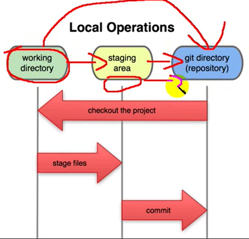

## *5. 创建版本库并提交文件*
仓库中所有文件都能北Git所追踪，方便还原和管理
- 初始化git本地仓库

通过`git init`命令把这个目录变成Git可以管理的仓库
在`.git`的同级目录下添加新建文件，通过`git status`查看工作目录和暂存区状态

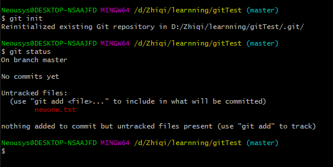
- 使用`git add`命令添加文件到暂存区

`git add <path>`命令中，path可以是文件也可以是目录，`git add`可以自动判别修改的文件以及目录，并添加到暂存区，如图所示，`git add .`所在路径下所有文件添加，当然你也可以指定文件和路径。`git status`可以看到，自动识别出新建文件，并加到暂存区，`(use "git rm --cached <file>..." to unstage)`还可以将文件移除暂存区。
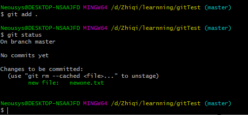
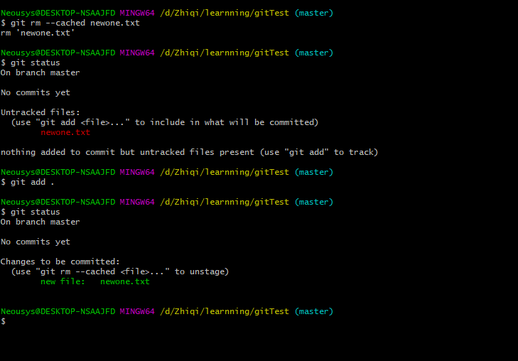

- 提交文件到本地仓库

文件保存到暂存区后，执行命令`git commit`告诉Git，把文件提交到本地仓库。在`git commit`后加上`-m`属性，加入本次提交的说明，
方便查看提交和修改记录。最后可以提通过`git log`来显示提交日志。
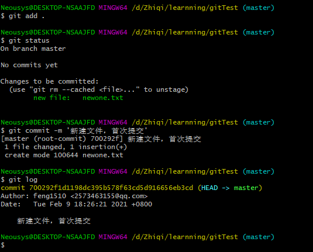

## *6. 时光穿梭机*
使用Git进行版本控制时， 通常会对项目不同版本的文件进行查看，项目历史版本切换。

### *6.1 文件修改与提交*
- 修改文件，通过`git status`可以查看修改状态

  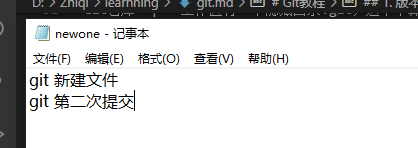
  

- 使用`git add`命令，`git commit -a`是`add`和`commit`的联合命令。
  如果`git commit`时忘记`-m`，会进入vim编辑模式。可以再进行添加说明。如下图所示。

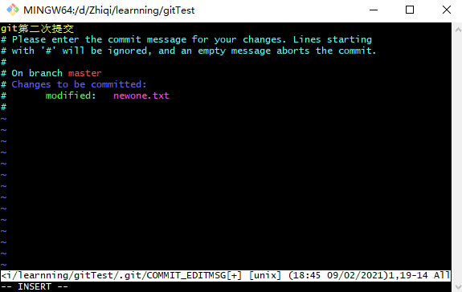
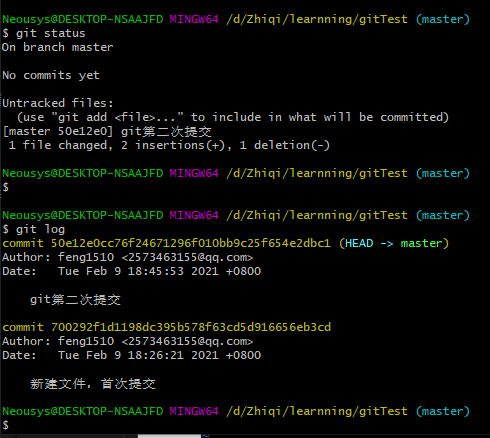

- 我们添加文字后，利用`git diff HEAD -- newone.txt`可以对比git仓库和工作区的文件的差异。

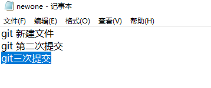
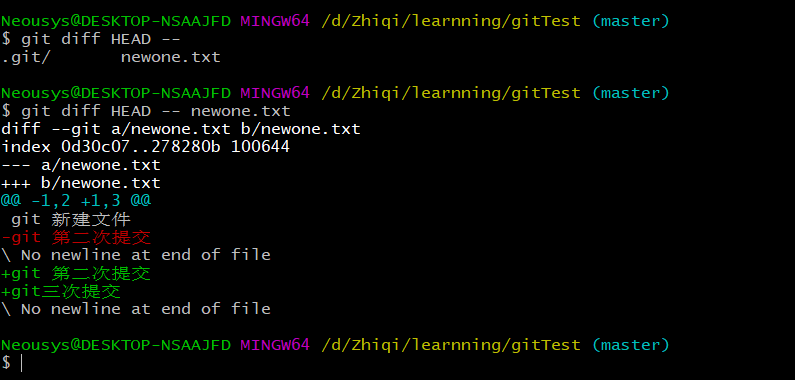

```
说明：
`---`:表示变动前的文件
`+++`:表示变动后的文件
变动位置用两个@作为起首和结束
@@ -1,2 +1,3 @@  ： 减号表示变动前文件从第1行连续2行，加号表示变动后文件第1行连续3行
```
- 暂存区提交与撤销
如果将某些文件错误添加到暂存区，git支持撤销操作，通过`git reset HEAD <files>`

### *6.2 版本回退*
当文件修改后被提交的次数较多时，对于存放的文件出现较多次版本，对于不同版本需要进行回退，在不同版本
的项目中进行切换。
- `git log`：用于显示提交日志

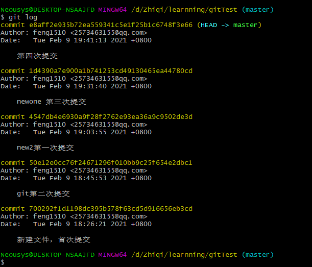

- 回退到上一个版本，执行`git reset --hard HEAD^`

  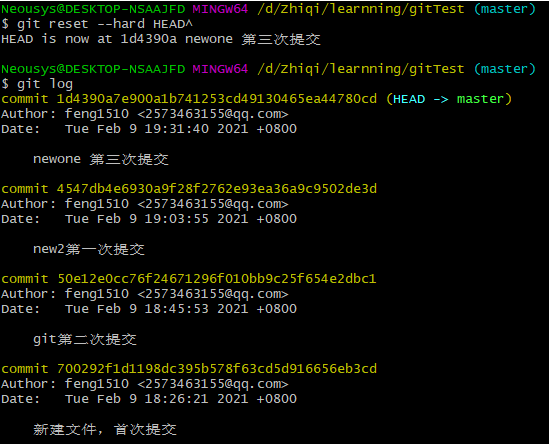
- 往回退`n`个版本，执行指令`git reset --hard HEAD~n`，波浪号+n
- 往前往后回退版本，命令`git reflog`显示所有提交版本，`git reset --hard <编号>`，可以回退到指定编号的版本
 
- `git log --pretty=oneline`命令可以简略显示提交日志，一行显示一条提交记录
 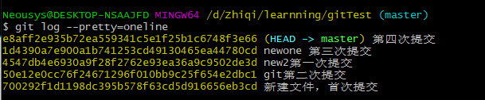

### *6.3 文件删除*
在Git中，删除文件同样也是一个修改操作。
- 误删工作区内文件，Git仓库中存在，但工作区中删除，`git status`可以查看。
 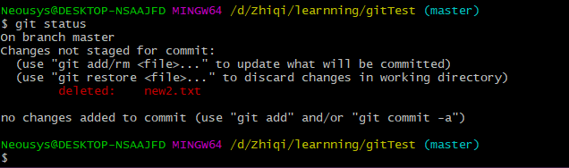
- `git restore <file>`可以恢复文件
- `git checkout <file>` 也可以恢复文件。`checkout`是去版本库中拉取文件到工作区。
---
- 所以只删除工作区的文件，可以在版本库中找到。所以如果要在版本库中删除，可以提交commit，因为一次删除也是一次修改，可以通过提交commit的方式在版本库中修改。
- 另一种方法删除版本库中文件，`git rm <file>`

 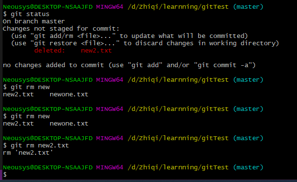

## *7. 远程仓库*
以上所有的仓库都是在本地仓库进行的，我们需要建立一个git远程仓库。其中`Github`,`Gitee`比较好。
- 远程拉取仓库， `git clone`
- 新建远程仓库，将本地的主分支上传。`git push -u origin master`，中间会要求输入账户和密码。
https://www.cnblogs.com/randompage/p/10275627.html

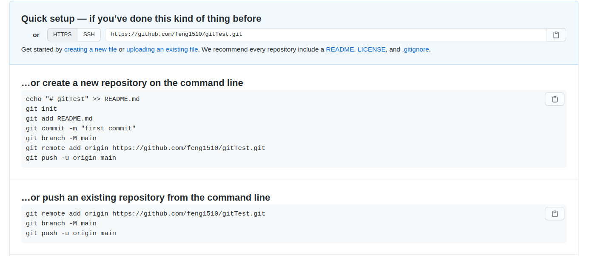
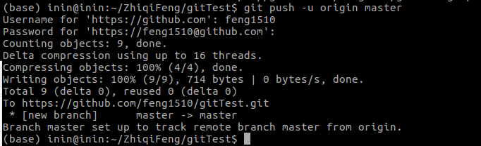

- Github推荐使用`ssh`密钥进行文件传输，更加安全稳定。设置如连接：https://blog.csdn.net/u013778905/article/details/83501204。

## *8. Git的分支操作*
在进行多人合作的项目中，个人通常不会在主干`master`上进行操作，而是重新开辟新的分支，在新分支上进行开发调试。当分支调试完成后，再合并到主干`master`上。

### *8.1 本地分支操作*

命令                            |      描述
--                            |:-----------------
`git checkout <branch>`       | 切换到指定分支
`git checkout -b <new_branch>`| 新建分支并切换到新建分支
`git branch -d <branch>`      | 删除指定分支
`git branch`                  | 查看所有分支，其中带*的为当前分支
`git merge branch`            | 合并分支
`git branch -m|-M <old_branch> <new_branch>` | 重命名分支，如果new_branch名字存在，则需要用`-M`进行强制重命名，否则使用`-m`重命名
`git pull`                | 命令用于从远程获取代码并合并本地的版本。


命令使用情况如下图所示:

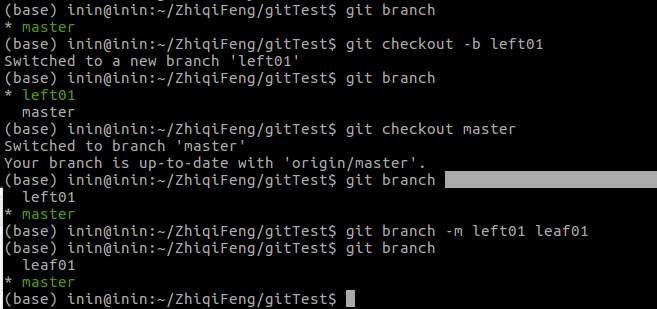

- 分支开发完成之后，要合并到主干master。切记，一定要切换到主干上，去合并分支。合并分支之后，可以删除本地分支。
  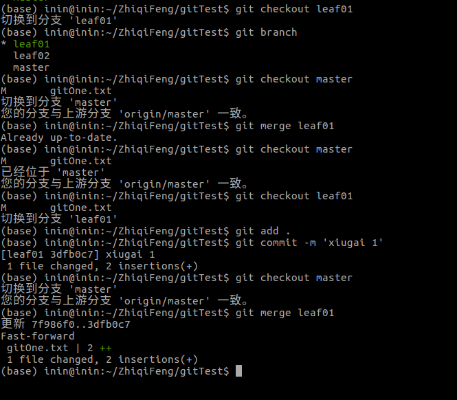

- git pull 其实就是 git fetch 和 git merge FETCH_HEAD 的简写。 命令格式如下：
```
git pull <远程主机名> <远程分支名>:<本地分支名>


将远程主机 origin 的 master 分支拉取过来，与本地的 brantest 分支合并。
git pull origin master:brantest

如果远程分支是与当前分支合并，则冒号后面的部分可以省略。
git pull origin master
上面命令表示，取回 origin/master 分支，再与本地的 brantest 分支合并。
```

### *8.2 远程分支操作， push和pull*
命令                            |      描述
--                            |:-----------------
`git branch -a`                                     | 查看本地和远程分支
`git push origin <branch_name>`                     | 推送本地分支到远程
`git push origin :<remote_branch>`                  | 删除远程分支，本地分支还保留
`git checkout -b local_branch origin/remote_branch` | 拉取远程指定分支并在本地创建分支

- 同时你也可以切换到不同分支，推送到远程仓库，如下图所示，切换到`leaf02`，并推送到远程。


- 删除本地分支，当你要删除自己当前所处的分支时，会报错提醒。因此切换到其他分支，再进行删除。
  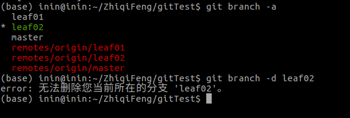
  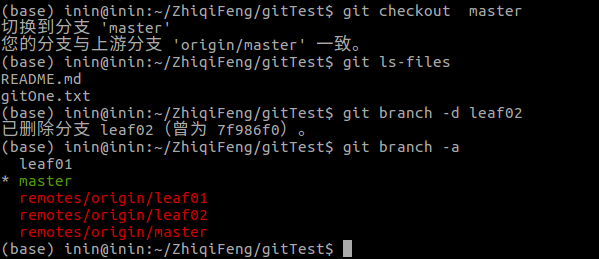

- 从远程重新拉取分支。如新加入一个项目组，开始已开发的项目，从现有项目分支中拉取相应分支进行开发。
 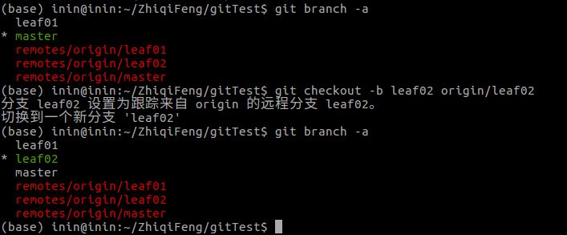

- 在项目完成之后，分支合并到主干，可以删除远程分支，但是本地分支还在。**提醒: 删除远程分支和推送远程分支命令很相似，小心使用**
 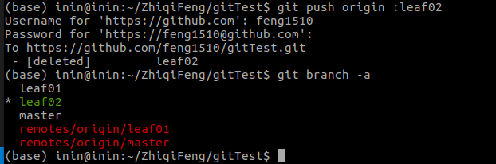

### *8.3 分支操作冲突出现与解决*
开发过程中对于不同分支下，同一文件下进行修改后执行合并时出现文件修改冲突。这里以master和leaf01为例说明。

#### *8.3.1 本地分支操作冲突*
- 以本地主干master和leaf01分支为例说明。
主干文件：
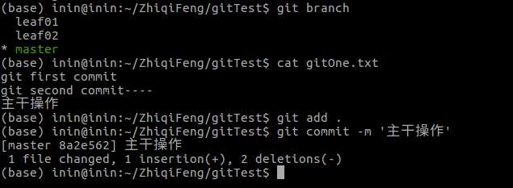
分支文件：

---
- 此时，如果直接在主干合并分支，出现冲突

  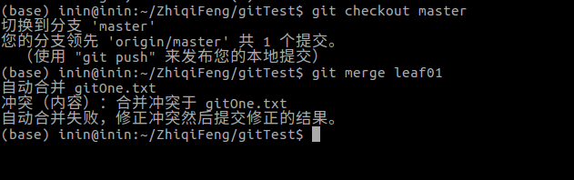
  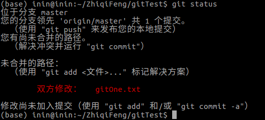
---
- 可以查看文件gitOne.txt，可以看到冲突

  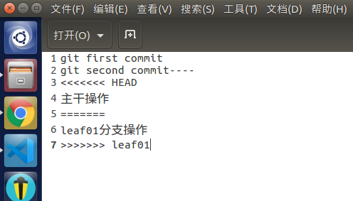
---
- 可以手动解决冲突，在提交master，即可

  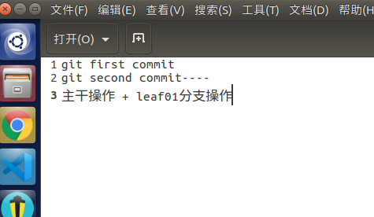
  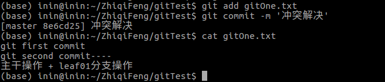
---
- 一般而言，不会经常去合并分支，都是在项目测试完成，分支确定无bug之后，再合并带主干上，所以合并次数不会太多。合并完成后，分支作用不大，可以删除。
- 通过，命令`git log --graph `，可以以图像的形式查看记录。`git log --graph --pretty=oneline`这个命令是更简洁的显示。
  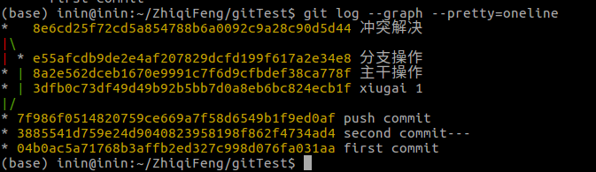


#### *8.3.2 多人协同合作的冲突*
本地冲突比较容易解决，因为都是个人操作的问题，可以尽量避免合并冲突，但是多人协同操作的时候难免会对同一文件同一位置进行操作，因此在合并的时候会产生冲突。模拟两个客户端进行操作如下：
- 两个终端模拟两个客户端，初始时刻本地仓库都是一样的，对两个客户端同以文件相同位置编辑不同文字，模拟冲突

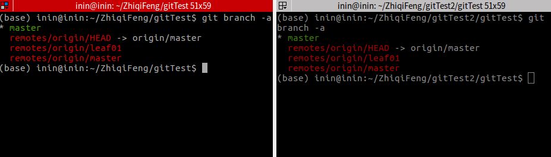
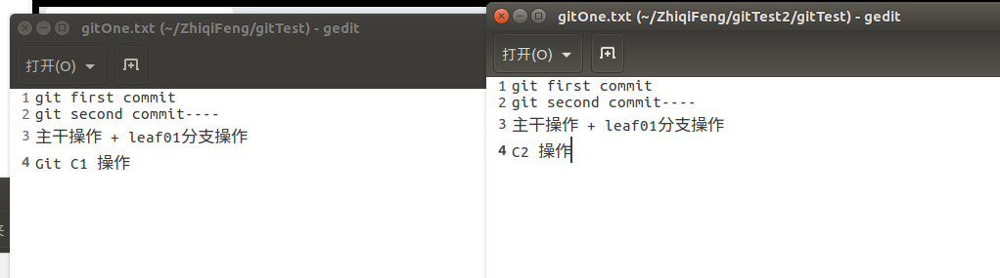
- 将C1主干推送到远程

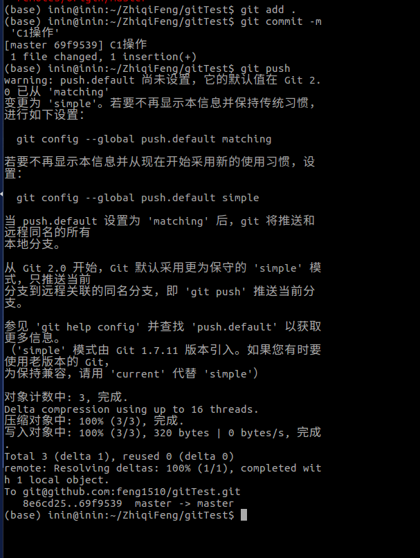
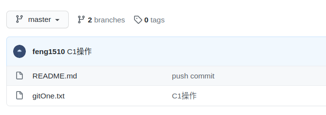
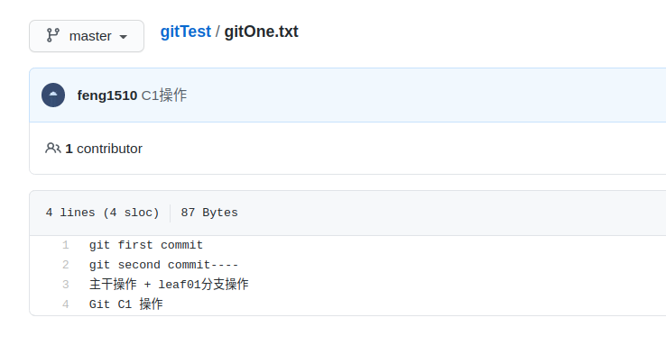
- 将C2操作推送到远程，失败，信息如下。

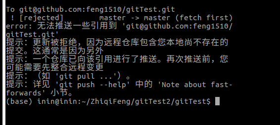
- 解决方法，先拉取远程分支的最新代码下来，存在冲突，在本地解决冲突后再进行推送。

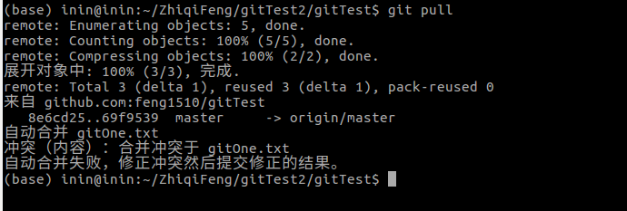
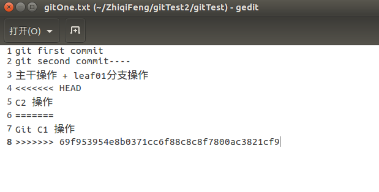
- 解决冲突，再add, commit，push推送到远程

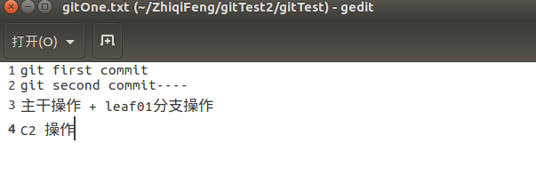
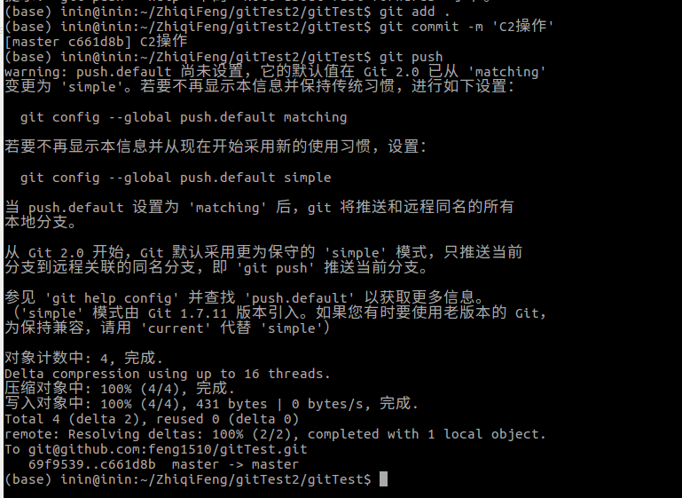
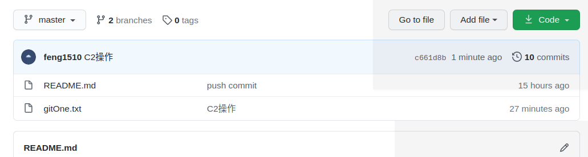
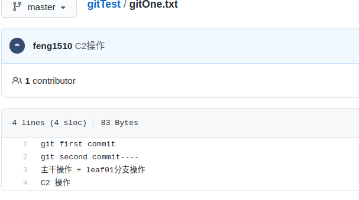

## *9. 标签管理*
标签的基本命令是`git tag`.
Git可以对某一时间点上的版本打上标签。开发过程中，发布某个版本，通常使用标签来分辨。

命令                            |      描述
--                            |:-----------------
`git tag <tag_name>`                          | 新建标签，默认为HEAD
`git tag -a tag_name -m 'XXXXX'`              | 添加标签并指定标签描述，如果未指定描述，则会使用commit时的描述
`git tag`                  | 查看所有标签
`git tag -d <tag_name>` | 删除一个本地标签
`git push origin <tag_name>` | 推送本地标签到远程
`git push origin --tags`  | 推送全部未推送的本地标签到远程
`git push origin :refs/tags/tag_name` | 删除一个远程标签

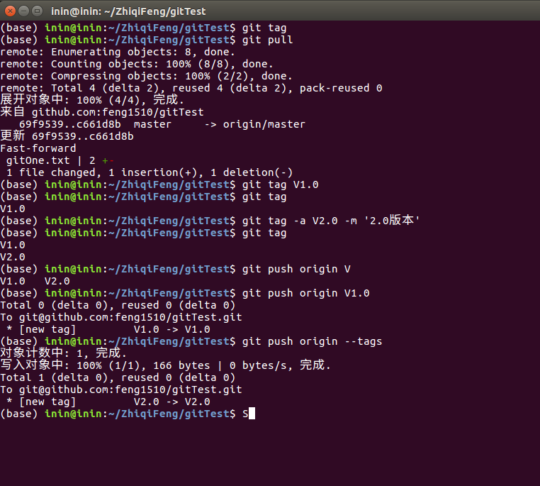
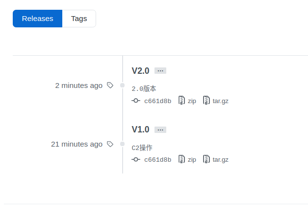