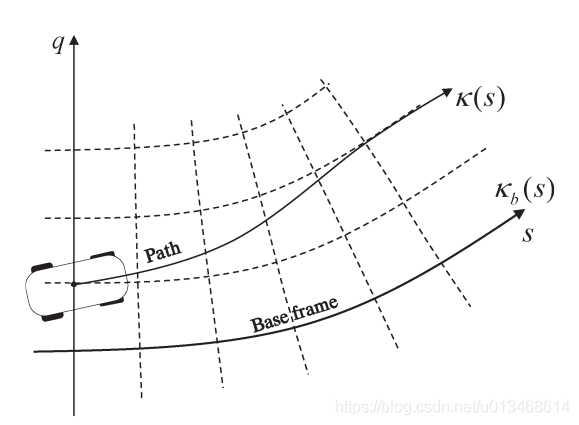
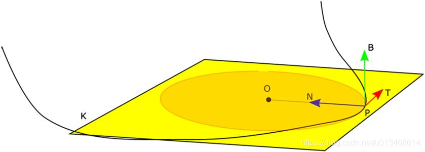
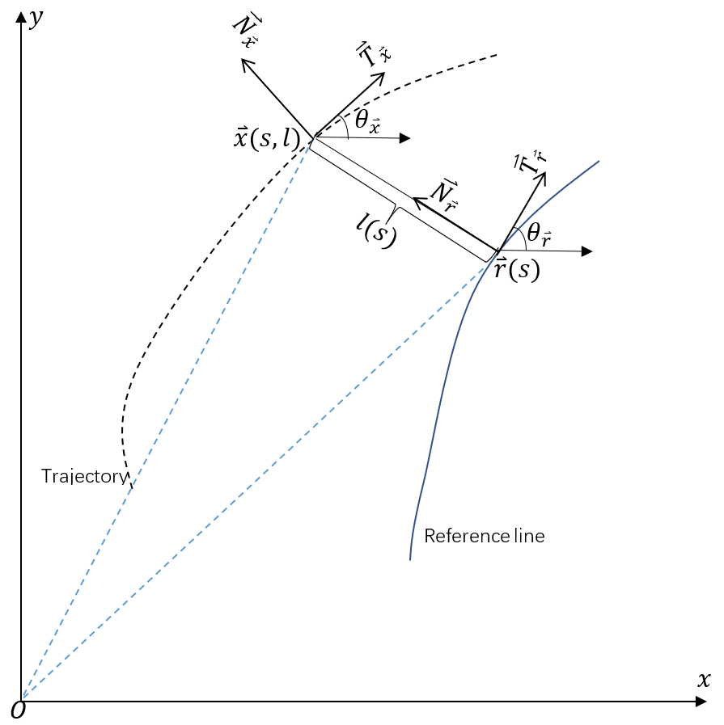
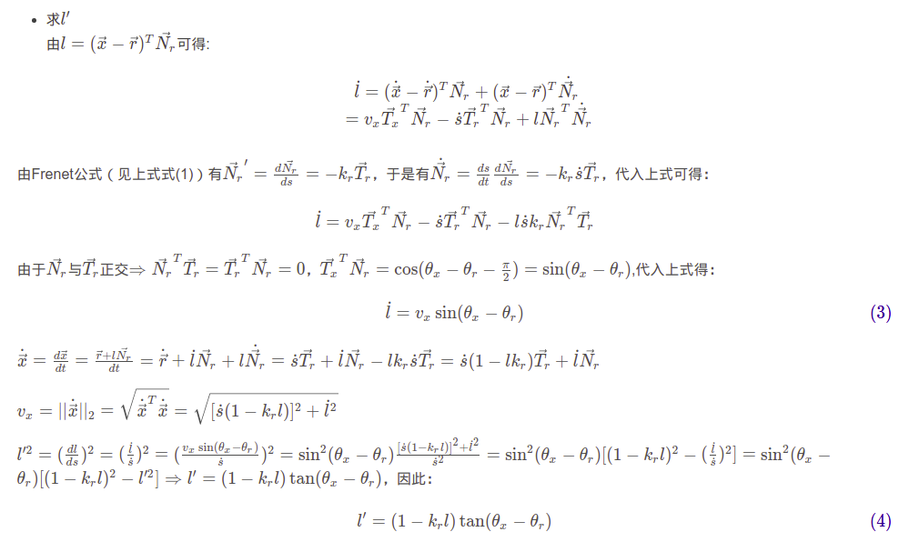
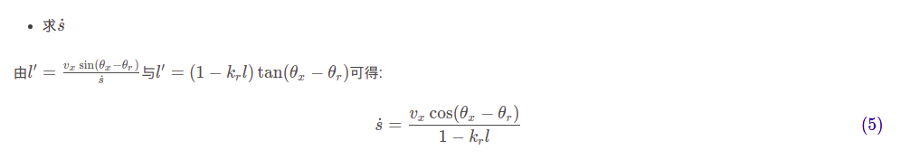
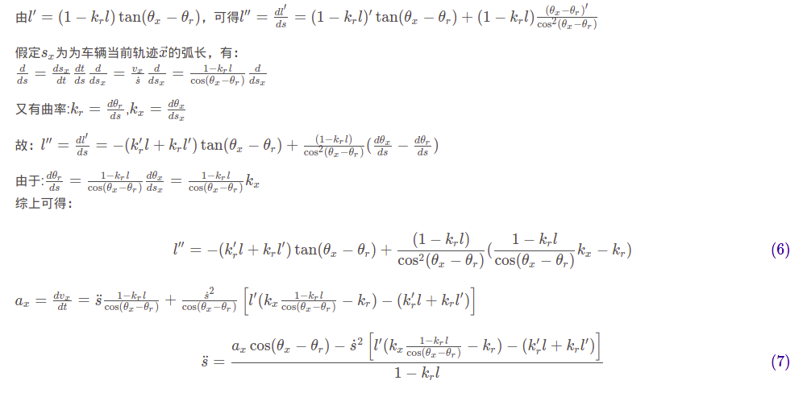
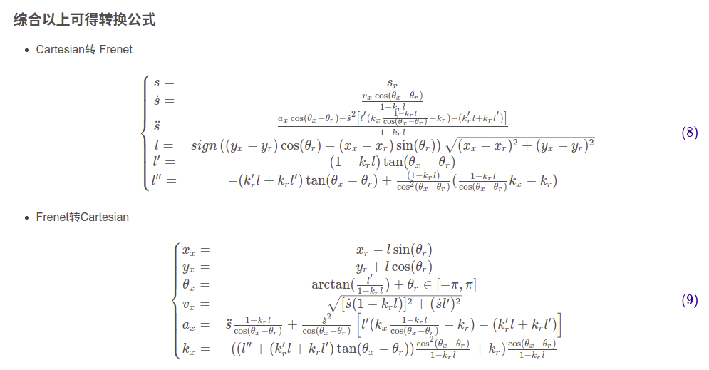

<!--
 * @Date: 2021-03-13 01:23:08
 * @Author: Zhiqi Feng
 * @LastEditors: feng 
 * @LastEditTime: 2021-03-13 07:33:09
 * @FilePath: /learnning/planning_learnning/Frenet2Cartesian/Frenet.md
-->
<!-- TOC -->

- [Frenet坐标系与Cartesian坐标系互转](#frenet坐标系与cartesian坐标系互转)
  - [一、Frenet坐标系与Cartesian坐标系的转换公式简单推导](#一frenet坐标系与cartesian坐标系的转换公式简单推导)
  - [二、转换公式](#二转换公式)
    - [2.1 $\vec{x} = [x_x, y_x]$推导$[s, l]$](#21-vecx--x_x-y_x推导s-l)
    - [2.2 已知$\vec{x}=[x_x, y_x], \theta_x, v_x$推导$[s, l, \dot{s}, l^{'}]$](#22-已知vecxx_x-y_x-theta_x-v_x推导s-l-dots-l)
    - [2.3 已知$\vec{x}=[x_x, y_x], \theta_x, v_x, a_x, \kappa_x$推导$[s, l, \dot{s}, l^{'}, \ddot{s}, l^{''}]$](#23-已知vecxx_x-y_x-theta_x-v_x-a_x-kappa_x推导s-l-dots-l-ddots-l)

<!-- /TOC -->
# Frenet坐标系与Cartesian坐标系互转
Frenet坐标系使用道路的中心线作为Base frame，使用参考线的切线向量和法线向量建立坐标系。相比笛卡尔坐标系，Frenet坐标系简化了路径规划问题。

参考文献：

[Apollo项目坐标系研究](https://blog.csdn.net/davidhopper/article/details/79162385)

[Frenet坐标系与Cartesian坐标系互转](https://blog.csdn.net/u013468614/article/details/108748016)

## 一、Frenet坐标系与Cartesian坐标系的转换公式简单推导
1.1 Frenet公式
下图显示了一条3D空间中一条连续可微的曲线`K`，`P`为曲线`K`上的一个点，黄色平面为曲线`K`在点`P`处的运动平面。

$\vec{T}$为曲线`K`在点`P`处的切向向量，$\vec{N}$为法向向量，$\vec{T}$和$\vec{N}$位于运动平面。$\vec{B}$为曲线`K`在`P`处的副法向量（$\vec{B}$垂直于运动平面）

令$\vec{r}(t)$为欧氏空间内随`t`改变的一条非退化曲线。所谓非退化曲线就是一条不会退化为直线的曲线，亦即曲率不为0的曲线。令$s(t)$是`t`时刻时曲线的累计弧长，其定义如下：

$$s(t) = \int_{0}^{t}||r^{,}(\sigma)||d\sigma$$

令$r^{,}(\sigma) \neq 0$, 则意味着$s(t)$是严格单调递增函数。因此可将s表示为t的函数，从而有：$\vec{r}(s)=\vec{r}(s(t))$，这样我们就把曲线表示为弧长s的函数。

对于采用弧长参数s表示的非退化曲线$\vec{r}(s)$,我们定义:

$$\vec{T}=\frac{\frac{{\rm d}{\bf\vec{r}}}{{\rm d}s}}{||\frac{{\rm d}{\bf\vec{r}}}{{\rm d}s}||}$$

$$\vec{N}=\frac{\frac{{\rm d}{\bf\vec{T}}}{{\rm d}s}}{||\frac{{\rm d}{\bf\vec{T}}}{{\rm d}s}||}$$

$$\vec{B} = \vec{T} \times \vec{N}$$

基于上述定义的Frenet–Serret公式表示为：

$$\frac{d\vec{T}}{ds} = \kappa\vec{N}$$
$$\frac{d\vec{N}}{ds} = -\kappa\vec{T} + \tau\vec{B}$$
$$\frac{d\vec{B}}{ds} = -\tau\vec{N}$$

对于无人驾驶车辆而言，一般对高度信息不感兴趣，因此可以将车辆运动曲线投影到同一平面内，亦即$\tau=0$,这样Frenet–Serret公式就可以简化为：

$$\frac{d\vec{T}}{ds} = \kappa\vec{N}$$
$$\frac{d\vec{N}}{ds} = -\kappa\vec{T}$$

## 二、转换公式
为什么要将笛卡尔坐标系转换为Frenet坐标系？因为可以这样可以将车辆的二维运动问题解耦合为两个一维运动问题。显然，一维问题比二维问题容易求解，这就是笛卡尔坐标系转换为Frenet坐标系的必要性。

Frenet 坐标：$[s, \dot{s}, \ddot{s}, l, \dot{l}, \ddot{l}, l^{'}, l^{''}]$

Cartesian坐标系: $[\vec{x}, v_{x}, a_{x},\theta_{x}, \kappa_{x}]$

- $s$ : Frenet纵坐标；
- $\dot{s} = \frac{ds}{dt}$ : Frenet纵坐标对时间的导数，也即沿base frame的速度；
- $\ddot{s} = \frac{d\dot{s}}{dt}$ :沿base frame的加速度；
- $l$：Frenet横坐标；
- $\dot{l} = \frac{dl}{dt}$ : Frenet横向速度；
- $\ddot{l} = \frac{d\dot{l}}{t}$ : Frenet横向加速度；
- $l^{'}$ : Frenet横向坐标对纵向坐标的导数；
- $l^{''}$ : Frenet横向坐标对纵向坐标的二次导数；

- $\vec{x}$：为对应Cartesian坐标系下的坐标，是一个向量；
- $\theta_{x}$：Cartesian坐标系下的朝向；
- $\kappa_{x} = \frac{\theta_{x}}{ds}$ ：曲率；
- $v_{x} = ||\dot{\vec{x}}||_{2}$：Cartesian坐标系下的线速度；
- $a_{x} = \frac{dv_{x}}{dt}$ ：Cartesian坐标系下的加速度；

### 2.1 $\vec{x} = [x_x, y_x]$推导$[s, l]$

- 求s
找到曲线上距离$[x_x, y_x]$最近的参考点$\vec{r} = [x_r, y_r]$, 该参考点下的s即为$[x_x, y_x]$在Frenet坐标系下的s。
- 求l
  在cartesian坐标系下的向量，$\vec{x} = \vec{r} +l\vec{N}_r$
$$l\vec{N}_r^{T}\vec{N}_r = \vec{N}_r^{T}[\vec{x}-\vec{r}]$$
$$l = \vec{N}_r^{T}[\vec{x}-\vec{r}]=[\vec{x}-\vec{r}]^{T}\vec{N}_r$$
$$l = (\vec{x}-\vec{r})^{T}\vec{N}_r=||\vec{x}-\vec{r}||_2cos(\theta_{x-r} - (\theta_r + \frac{\pi}{2}))=||\vec{x}-\vec{r}||_2(sin(\theta_{x-r}cos(\theta_r)-cos(\theta_{x-r})sin(\theta_r)))$$

假设$\vec{x}=(x_x, y_x)$, $\vec{r} = (x_r, y_r)$, 则$||\vec{x}-\vec{r}||_2=\sqrt{(x_x-x_r)^2+(y_x-y_r)^2}$

在Frenet坐标系下，每个点到base frame上参考点的向量都与该参考点的法向量$\vec{N}$同向或反向,所以$sin(\theta_{x-r}cos(\theta_r)-cos(\theta_{x-r})sin(\theta_r))=1$或-1。$\theta_{x-r}$为向量$[\vec{x}-\vec{r}]$的角度，因此，
$\frac{sin(\theta_{x-r})}{cos(\theta_{x-r})}=\frac{y_x-y_r}{x_x-x_r}$,所以根据$(y_x-y_r)cos(\theta_r)-(x_x-x_r)sin(\theta_r)$的正负来判断l的正负
$$l=sign((y_x-y_r)cos(\theta_r)-(x_x-x_r)sin(\theta_r))\sqrt{(x_x-x_r)^2+(y_x-y_r)^2}$$

### 2.2 已知$\vec{x}=[x_x, y_x], \theta_x, v_x$推导$[s, l, \dot{s}, l^{'}]$

### 2.3 已知$\vec{x}=[x_x, y_x], \theta_x, v_x, a_x, \kappa_x$推导$[s, l, \dot{s}, l^{'}, \ddot{s}, l^{''}]$

