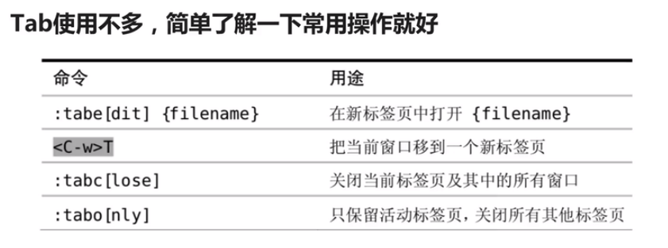
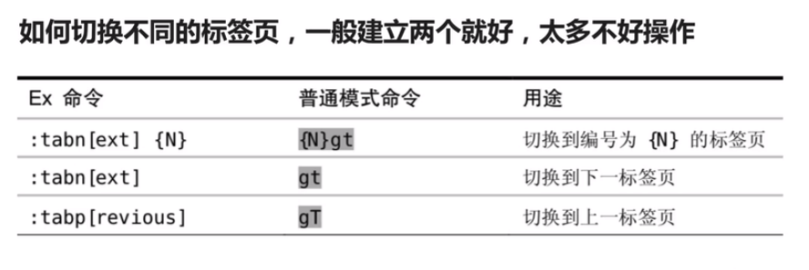
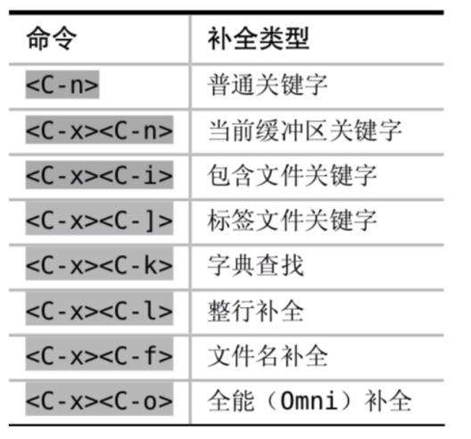

<!-- TOC -->

- [*vim 学习笔记*](#vim-%E5%AD%A6%E4%B9%A0%E7%AC%94%E8%AE%B0)
    - [*1. 进入*](#1-%E8%BF%9B%E5%85%A5)
    - [*2. 快速移动*](#2-%E5%BF%AB%E9%80%9F%E7%A7%BB%E5%8A%A8)
        - [*2.1 单词之间移动*](#21-%E5%8D%95%E8%AF%8D%E4%B9%8B%E9%97%B4%E7%A7%BB%E5%8A%A8)
        - [*2.2 行间搜索移动*](#22-%E8%A1%8C%E9%97%B4%E6%90%9C%E7%B4%A2%E7%A7%BB%E5%8A%A8)
        - [*2.3 Vim 水平移动*](#23-vim-%E6%B0%B4%E5%B9%B3%E7%A7%BB%E5%8A%A8)
        - [*2.4 Vim 垂直移动*](#24-vim-%E5%9E%82%E7%9B%B4%E7%A7%BB%E5%8A%A8)
        - [*2.5 页面移动*](#25-%E9%A1%B5%E9%9D%A2%E7%A7%BB%E5%8A%A8)
    - [*3. 快速增删改查*](#3-%E5%BF%AB%E9%80%9F%E5%A2%9E%E5%88%A0%E6%94%B9%E6%9F%A5)
        - [*3.1 增加字符*](#31-%E5%A2%9E%E5%8A%A0%E5%AD%97%E7%AC%A6)
        - [*3.2 快速删除*](#32-%E5%BF%AB%E9%80%9F%E5%88%A0%E9%99%A4)
        - [*3.3 快速修改*](#33-%E5%BF%AB%E9%80%9F%E4%BF%AE%E6%94%B9)
        - [*3.4 Vim查询*](#34-vim%E6%9F%A5%E8%AF%A2)
    - [*4. Vim搜索替换*](#4-vim%E6%90%9C%E7%B4%A2%E6%9B%BF%E6%8D%A2)
        - [*4.1 Vim替换命令*](#41-vim%E6%9B%BF%E6%8D%A2%E5%91%BD%E4%BB%A4)
    - [*5. 多文件操作*](#5-%E5%A4%9A%E6%96%87%E4%BB%B6%E6%93%8D%E4%BD%9C)
        - [*5.1 Buffer, Window, Tab*](#51-buffer-window-tab)
    - [*6. 文本对象 text object*](#6-%E6%96%87%E6%9C%AC%E5%AF%B9%E8%B1%A1-text-object)
        - [*6.1 文本对操作方式*](#61-%E6%96%87%E6%9C%AC%E5%AF%B9%E6%93%8D%E4%BD%9C%E6%96%B9%E5%BC%8F)
    - [*7. Vim复制粘贴于寄存器使用*](#7-vim%E5%A4%8D%E5%88%B6%E7%B2%98%E8%B4%B4%E4%BA%8E%E5%AF%84%E5%AD%98%E5%99%A8%E4%BD%BF%E7%94%A8)
        - [*7.1 normal模式下复制粘贴*](#71-normal%E6%A8%A1%E5%BC%8F%E4%B8%8B%E5%A4%8D%E5%88%B6%E7%B2%98%E8%B4%B4)
        - [*7.2 什么是Vim寄存器*](#72-%E4%BB%80%E4%B9%88%E6%98%AFvim%E5%AF%84%E5%AD%98%E5%99%A8)
        - [*7.3 深入寄存器register*](#73-%E6%B7%B1%E5%85%A5%E5%AF%84%E5%AD%98%E5%99%A8register)
    - [*8. 强大的Vim宏（macro）*](#8-%E5%BC%BA%E5%A4%A7%E7%9A%84vim%E5%AE%8Fmacro)
    - [*9. Vim的补全方法*](#9-vim%E7%9A%84%E8%A1%A5%E5%85%A8%E6%96%B9%E6%B3%95)
    - [* 10. 修改Vim配色*](#-10-%E4%BF%AE%E6%94%B9vim%E9%85%8D%E8%89%B2)

<!-- /TOC -->
# *vim 学习笔记*
## *1. 进入*
insert->normal  Esc

normal->insert的几种方式：
'a' append 		: 在光标之后插入文本

'i' insert		：在光标之前插入文本

'o' open a line below	：在行下面插入

'A' Apend		：在行尾部插入

'I' 			：在行首插入

'O'			：在上一行插入

visual			：可视化模式

在normal模式下，'v'进入,可以进行文本的选择操作

'V'			：选择行

'ctrl'+'v'		：选择块

## *2. 快速移动*
normal模式下：
单个字符之间进行移动：hjkl

### *2.1 单词之间移动*
- w/W移动到下一个word/WORD开头。 e/E移动到下一个word/WORD尾。
- b/B回到上一个word/WORD开头，可以理解为backword.

"word":为非空白隔分割的单词
"WORD":以空隔为分割的单词

### *2.2 行间搜索移动*
在一行之内，搜索一个字符并移动到字符的位置
- 使用`f{char}`可以移动到`char`字符上, 使用`t`移动到`char`的前一个字符。
- 如果第一次没有搜索到，可以使用分号（;）和逗号（,）移动到上一个和下一个。 
### *2.3 Vim 水平移动*
- `0`：移动到行首第一个字符, `^`：移动到行首一个非空白字符。
- `$`：移动到行尾， `g_`：移动到行尾非空白字符。
### *2.4 Vim 垂直移动*
- `（）`：使用括号进行垂直移动
### *2.5 页面移动*
- `gg`：移动到文件开头，`G`：移动到文件结尾， 使用`ctrl+o`快速返回。
- 快速跳转到屏幕的位置 `H/M/L`  : 开头（Head）,中间（Middle），结尾（Lower）。
- `ctrl+u`, `ctrl + f` 上下翻页（upward/forward）, `zz`:把当前行置于屏幕中间

## *3. 快速增删改查*
### *3.1 增加字符*
- insertm模式
- a/i/o   A/I/O
### *3.2 快速删除*
- vim 在normal模式下使用 `x` 快速删除一个字符
- 使用`d(delete)` 配合文本对象块速删除一个单词`daw`(d around word), `dd`：删除整行。
- `d`和`x`配合数字来执行多次, 数字+d或者数字+x 

### *3.3 快速修改*
- 常用的三个： r(replace), c(change), s(substitute)
- normal模式下， 使用`r`替换一个字符，`s`删除字符并进入插入模式。
  'R'进入‘replace’模式，不断进行替换，'S':删除一整行并进入插入模式。
- 使用`c`配合文本对象块，进行删除，并进入插入模式。
### *3.4 Vim查询*
- 使用`/`和`？`进行前向和反向搜索
- 使用`n`和`N`跳转到下一个和上一个匹配的字符
- 使用`*`和`#`进行到当前单词的前向和后向匹配
## *4. Vim搜索替换*
### *4.1 Vim替换命令*
- substitute命令允许我们查找并且替换掉文本，并且支持正则表达式
    - `:[range]s[ubatitute]/{pattern}/{string}/[flags]`：[range]表示范围，`:10,20`表示10-20行， `%`表示全部
    - `pattern`表示要替换的模式， `string`表示替换后的文本
    - `Flages`表示标志：
        - `g(global)`表示全局范围内执行
        - `c(confirm)`表示确认，可以确认或者拒绝修改
        - `n(number)`报告匹配的次数而不替换，可以用来查询匹配次数
    - 使用正则化方法，精确替换单词。`\<pattern\>`
        - 例如`:% s/\<pattern\>/string/g` 

## *5. 多文件操作*
### *5.1 Buffer, Window, Tab*
- Buffer: 打开的一个文件内存缓冲区
    - Vim打开一个文件后会加载文件内容到缓冲区
    - 之后的修改都是针对内存缓冲区，并不会直接保存文件
    - 直到运行`:w`才会把修改的内容写入到文件中
    - 如何进行Buffer的切换
        - 使用`:ls`列举当前缓冲区，然后使用`:b n`跳转到第n个缓冲区
        - `:bpre, :bnext, :bfirst, :blast`进行跳转
        - 或者利用`:b buffer_name`加上Tab补全来进行跳转
- Window: 是Buffer的可视化的分割区域
    - 每个窗口可以打开多个缓冲区,一个缓冲区也可以分割成多个窗口
    - `:sp(split)`和`vs(Vertical split)`来进行分割
    - 切换窗口
    
    
- Tab   ：可以组织窗口为一个工作区
    - Tab标签页：容纳一系列窗口的容器
    
    

## *6. 文本对象 text object*
其他编辑器一般通过对单个字符进行操作，而vim可以对一个文本对象进行操作，即可以直接对一个单词，一句话等举行操作
### *6.1 文本对操作方式*
- 例如使用`dw`
- `[number]<command>[text object]`： `[number]`表示操作次数，`<command>`表示命令，如d(delete), c(cahnge), y(yank)
- '[text object]'表示操作的文本对象，比如单词w, 句子s, 段落p

- 删除范围内的内容，如括号，双引号

## *7. Vim复制粘贴于寄存器使用*
### *7.1 normal模式下复制粘贴*
- 复制粘贴：y(yank)和p(put), 剪切和粘贴：d和p
- 使用v(visual)命令选中复制的区域，使用p进行粘贴
- 配合文本对象进行操作
- 复制和剪切的内容都是存放在寄存器中

### *7.2 什么是Vim寄存器*
- Vim操作的是寄存器而不是系统剪切板
- 默认使用`d`来删除或者`y`复制的内容都放"无名寄存器"内
- 用`x`删除一个字符放在无名寄存器，然后`p`粘贴，可以调换两个字符
### *7.3 深入寄存器(register)*
- Vim不使用单一剪贴板进行剪贴、复制和粘贴，而是使用多组寄存器
- 通过双引号`"{register}`前缀可以指定寄存器，不指定则使用默认的无名寄存器

## *8. 强大的Vim宏（macro）*
- 宏的使用分为录制和回放
- vim使用q来录制，同时也是q来结束录制
- 使用q{register}选择要保存的寄存器，把录制的命令保存其中
- 使用@{register}回放寄存器中保存的一系列命令
- V选择一行，使用G全选剩下的，然后在命令行模式下：normal 就是使用normal模式下的命令， `:normal @{register}` 就可以将剩下的全部执行记录下的宏。

## *9. Vim的补全方法*

- 常用的三种补全方法
    - 使用`ctrl + n` 和 `ctrl + p` 补全单词
    - 使用`ctrr + x` 和 `ctrl + f` 来补全文件名
    - 使用`ctrl + x` 和 ` ctrl + o`补全代码，需要安装插件

## *10. 修改Vim配色*
- `:colorscheme` 显示当前主题配色

- `:colorscheme <ctrl+d>` 显示所有配色

- `:colorscheme <name>` 修改配色

- `vim file1 file2 -O` 分窗口打开文件名所涉及的文件

